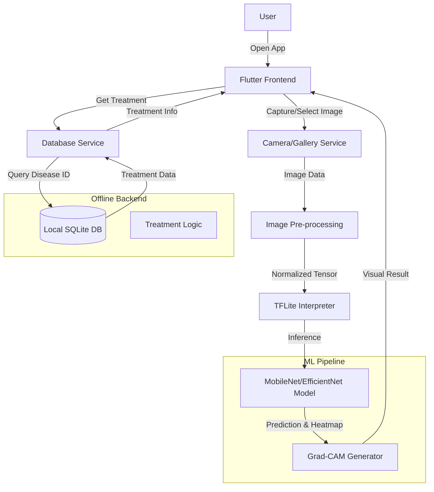

# AgriVision System Architecture

## Overview
AgriVision is an offline-first Android application designed to assist farmers in detecting plant diseases using on-device Machine Learning (TFLite). It provides explainable AI (Grad-CAM) and actionable treatment recommendations stored in a local SQLite database.

## high-Level Architecture

## Folder Structure Mapping
- `app/lib/` -> `d:/plant_analysis/lib/`
- `app/assets/` -> `d:/plant_analysis/assets/` (To be created)
- `ml/` -> `d:/plant_analysis/ml/` (Model storage)
- `backend/` -> `d:/plant_analysis/backend/` (DB Schemas, Reference Data)

## Data Flow
1.  **Input**: Leaf Image (Camera/Storage).
2.  **Processing**: Resize (224x224), Normalize (0-1).
3.  **Inference**:
    -   Input: `[1, 224, 224, 3]`
    -   Output 1: `[1, N_CLASSES]` (Probabilities)
    -   Output 2: `[1, 7, 7, CHANNELS]` (Last Conv Layer for Grad-CAM - if supported)
4.  **Database**:
    -   `diseases` table: `id`, `name`, `scientific_name`, `description`.
    -   `treatments` table: `disease_id`, `type` (chemical/organic/prevention), `instruction`.
    -   `scans` table: `id`, `image_path`, `disease_id`, `confidence`, `timestamp`.

## Tech Stack
-   **Frontend**: Flutter
-   **ML**: TensorFlow Lite (`tflite_flutter`)
-   **DB**: SQLite (`sqflite`)
-   **State**: Provider
